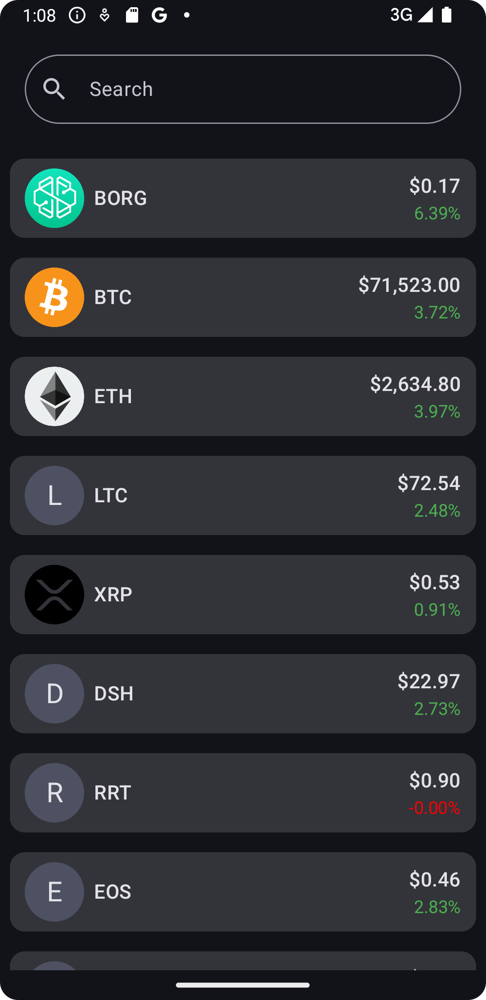
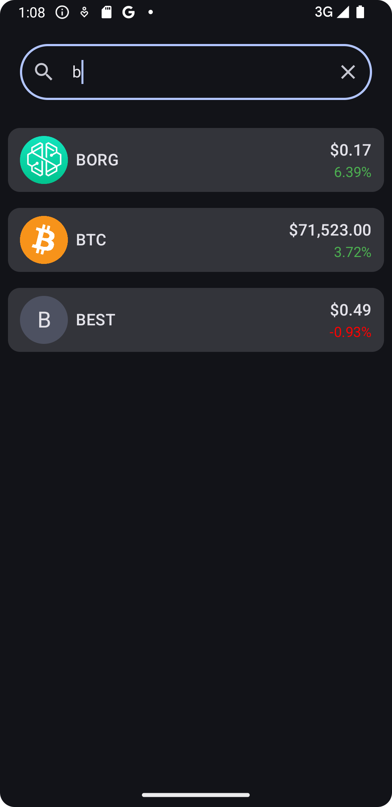
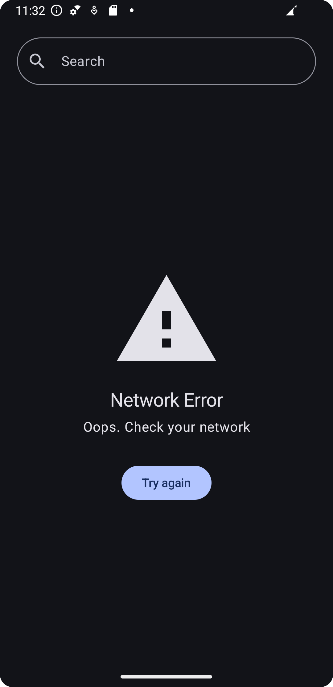
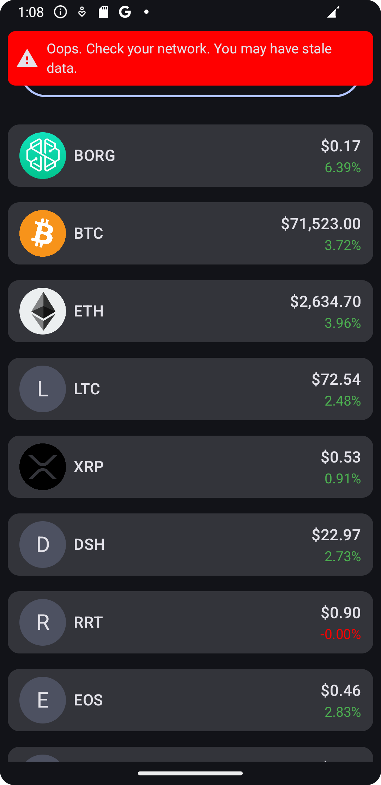
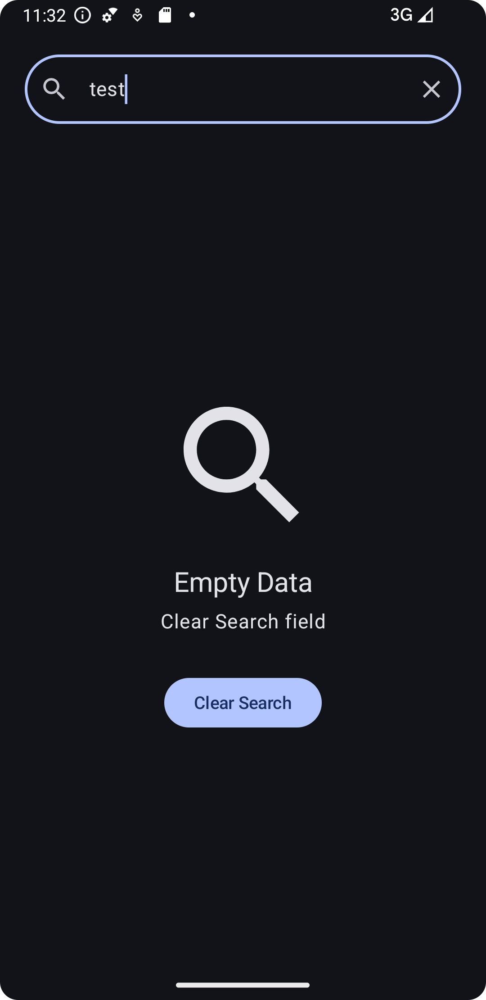

    
    <h1>Crypto Market</h1>
    
An Android application for getting the latest prices in the crypto world

---

  
  
  

  
  
  

## Features
- Get the latest token prices in USD
- Filter by tokens
- Data refreshes every 5 seconds
- Data also refreshes on network reconnection

## TODO
- Add GitHub Actions to create pull requests and automatically run tests
- Add screenshot tests with Compose previews
- Support more than just USD for prices
- Navigate to a new screen when an item is clicked
- Add some theme colors for SDK 31+